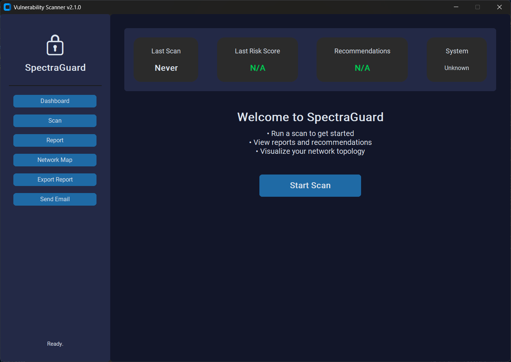

# SpectraGuard - Advanced Windows Security Scanner

A comprehensive security auditing and vulnerability assessment tool with a modern GUI interface.



## 🚀 Features

- **System Vulnerability Scanning:**  
  Gathers detailed information about OS, updates, antivirus status, firewall, user/admin accounts, password policy, running services, startup programs, BitLocker, UAC, exploit protection, RDP, Windows Update, boot config, and more.

- **Network Scanning:**  
  Detects open ports, network adapters, DNS cache, ARP table, RPC endpoints, VLAN info, and visualizes network topology.

- **Security Event Analysis:**  
  Retrieves recent security events from Windows event logs.

- **Resource Usage Monitoring:**  
  Displays current CPU, RAM, and disk usage.

- **Automated Recommendations:**  
  Analyzes scan results and provides actionable security recommendations.

- **Risk Scoring:**  
  Calculates a risk score based on detected issues and warnings.

- **Report Generation:**  
  Exports scan results as TXT, JSON, and PDF reports.

- **Network Topology Visualization:**  
  Generates and displays a minimal, clear network map using matplotlib and networkx.

- **Email Reporting:**  
  Sends PDF reports and network topology images via email.

- **Modern GUI:**  
  Clean, dark-themed interface with dashboard, scan, report, and network map views.

## 📋 Prerequisites

- Windows 10/11 (64-bit)
- Python 3.8 or higher
- Administrator privileges
- [Nmap](https://nmap.org/) (Optional - will be auto-installed if missing)

## 🛠️ Installation

1. **Clone the repository:**
   ```bash
   git clone https://github.com/mithilesh7723/SpectraGuard.git
   cd SpectraGuard
   ```

2. **Create and activate virtual environment (Optional):**
   ```bash
   python -m venv venv
   .\venv\Scripts\activate
   ```

3. **Install required packages:**
   ```bash
   pip install -r requirements.txt
   ```
4. **Running The Script**
   ```bash
   python SpectraGuard.py
   ```

## ⚙️ Configuration

### Required Environment Variables

- **SMTP Settings:**  
  Set the following environment variables before running the app:
  - `VULN_SMTP_SERVER` (e.g. `smtp.gmail.com`)
  - `VULN_SMTP_PORT` (default: `587`)
  - `VULN_SMTP_USERNAME` (your email address)
  - `VULN_SMTP_PASSWORD` (your app password or email password)

- **Risky Ports:**  
  The list of risky ports is customizable in the code.

## File Outputs

- `vulnerability_report.txt` — Human-readable scan report.
- `vulnerability_report.json` — Structured scan data.
- `vulnerability_report.pdf` — Printable PDF report.
- `network_topology.png` — Network map image.

## Requirements

- Windows OS (uses PowerShell and Windows-specific APIs)
- Python 3.8+
- Required Python packages (see above)

## Security

- Some features require administrator privileges for full access to system and security data.

## License

This project is for educational and internal use only.

